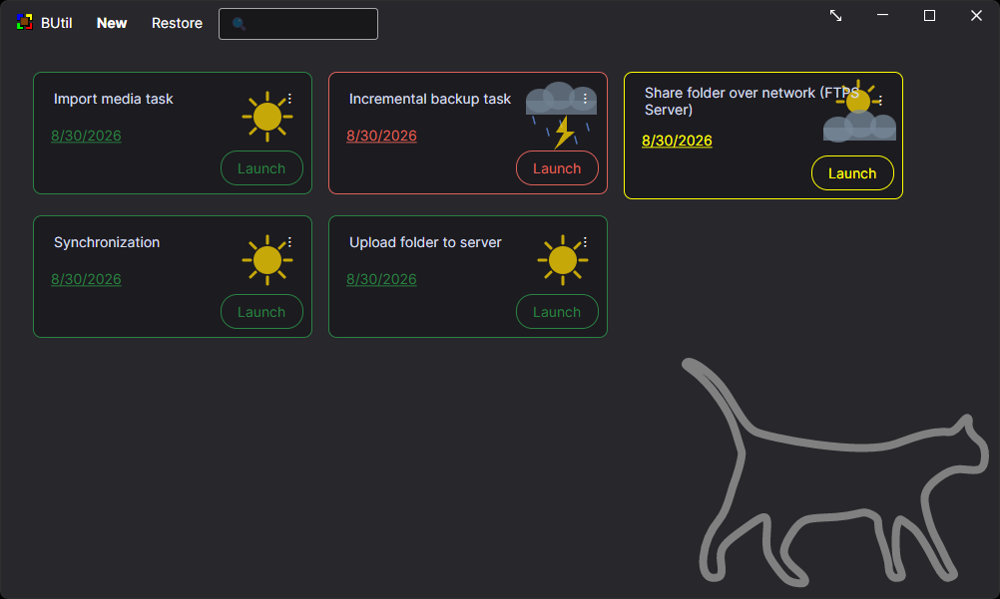

# Screenshots

Application screens from BUtil.

## Zero Screen

## Dashboard

## Incremental backup

### Task - Incremental backup task - Create - 1

### Task - Incremental backup task - Create - 2

### Task - Incremental backup task - Create - 3

### Task - Incremental backup task - Create - 4

### Task - Incremental backup task - Create - 5

### Task - Incremental backup task - Actions on dashboard

### Task - Incremental backup task - Run

### Task - Incremental backup task - Restore - 1

### Task - Incremental backup task - Restore - 2

### Task - Incremental backup task - Restore - 3

### Task - Incremental backup task - Restore - 4

### Task - Incremental backup task - Restore - 5

## Import media

### Task - Import media task - Create - 1

### Task - Import media task - Create - 2

### Task - Import media task - Create - 3

### Task - Import media task - Create - 4

### Task - Import media task - Run

## Synchronization

### Task - Synchronization - Creating - 1

### Task - Synchronization - Creating - 2

### Task - Synchronization - Dashboard actions

### Task - Synchronization - Run

### Task - Synchronization - Restore

## Share folder over network (FTPS Server)

### Task - Share folder over network (FTPS Server) - Create - 1

### Task - Share folder over network (FTPS Server) - Create - 2

### Task - Share folder over network (FTPS Server) - Create - 3

### Task - Share folder over network (FTPS Server) - Run - 1

### Task - Share folder over network (FTPS Server) - Run - 2

## Upload folder to server

### Task - Upload folder to server - Creating

### Task - Upload folder to server - Run

## Technical tools

### Technical view - Compress

### Technical view - Decompress

### Technical view - Encrypt

### Technical view - Decrypt

### Technical view - Prevent sleep - Configuration

### Technical view - Prevent sleep - Running

